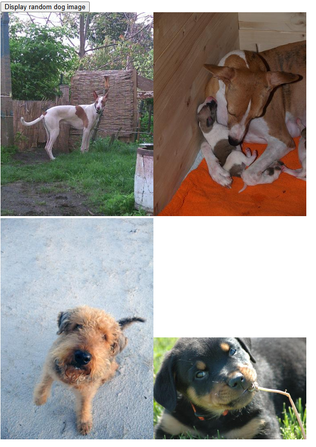

# Project Description
This project is consuming the web API found at https://dog.ceo/dog-api/ using JS/TS to practice utilizing web APIs

## Getting started with local development
- Clone the repository
- Compile TypeScript `tsc --watch` the `watch` argument will compile the TypeScript when there are code changes extension in VS Code
- Run the website locally using the `Live Server` extension in VS Code

## GitHub Pages
View the live website at https://lunarseacatfish.github.io/DogAPIExample/

## Examples
Random dog sample: 